# OpenClaw Switch

[](LICENSE)
[](package.json)
[](https://www.electronjs.org/)

> OpenClaw API Key 管理与切换工具 —— 一个桌面 GUI 应用，帮助你轻松管理多个 AI 服务提供商的 API Key，一键切换默认模型，启动和管理 OpenClaw Gateway。

## 功能特性

- **多 Provider 管理** — 添加、编辑、删除多个 AI 服务提供商（DeepSeek、OpenAI、Anthropic、Ollama 等）
- **API Key 切换** — 为每个 Provider 保存多套 API Key Profile，一键切换
- **模型管理** — 添加模型、选择默认模型，内置常用模型预设（DeepSeek V3/R1、Claude、GPT-4o、Kimi K2、Qwen3 等）
- **Gateway 控制** — 一键启动/停止 OpenClaw Gateway，实时查看运行日志
- **Dashboard 访问** — 直接打开 OpenClaw Dashboard 管理界面
- **安装向导** — 首次使用自动检测环境，引导安装 Node.js 和 OpenClaw
- **系统托盘** — 最小化到系统托盘，后台常驻

## 截图

### 安装向导

| 欢迎页 | 环境检测 | 安装 Node.js |
|:---:|:---:|:---:|
| 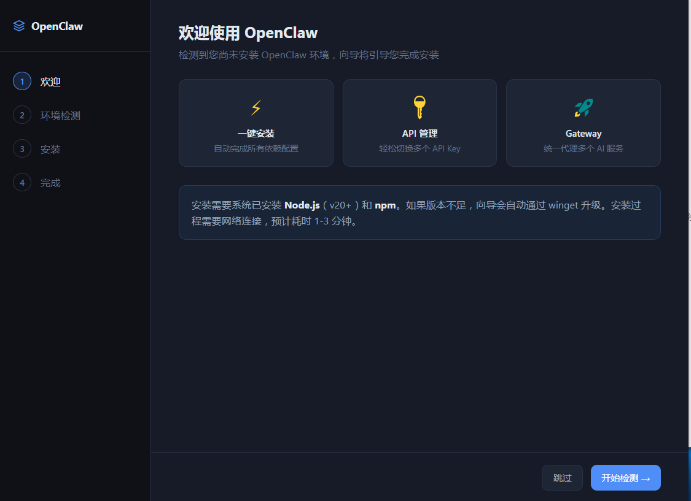 | 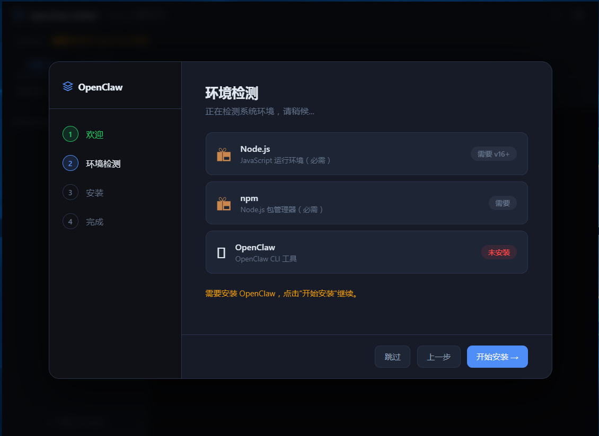 | 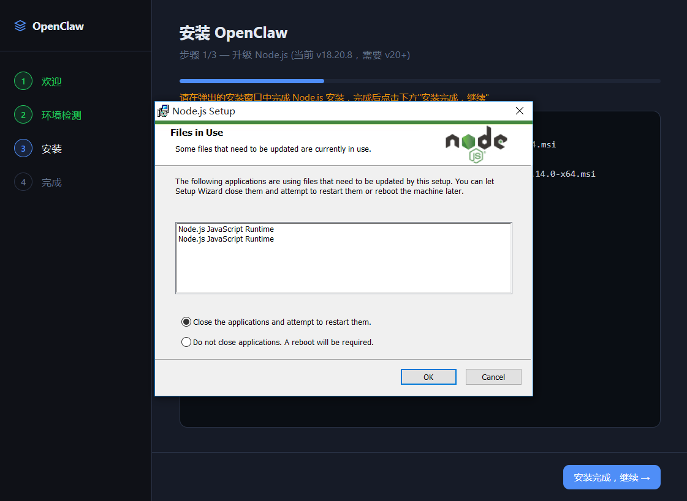 |

| 安装 npm | 安装 OpenClaw | 初始化配置 |
|:---:|:---:|:---:|
| 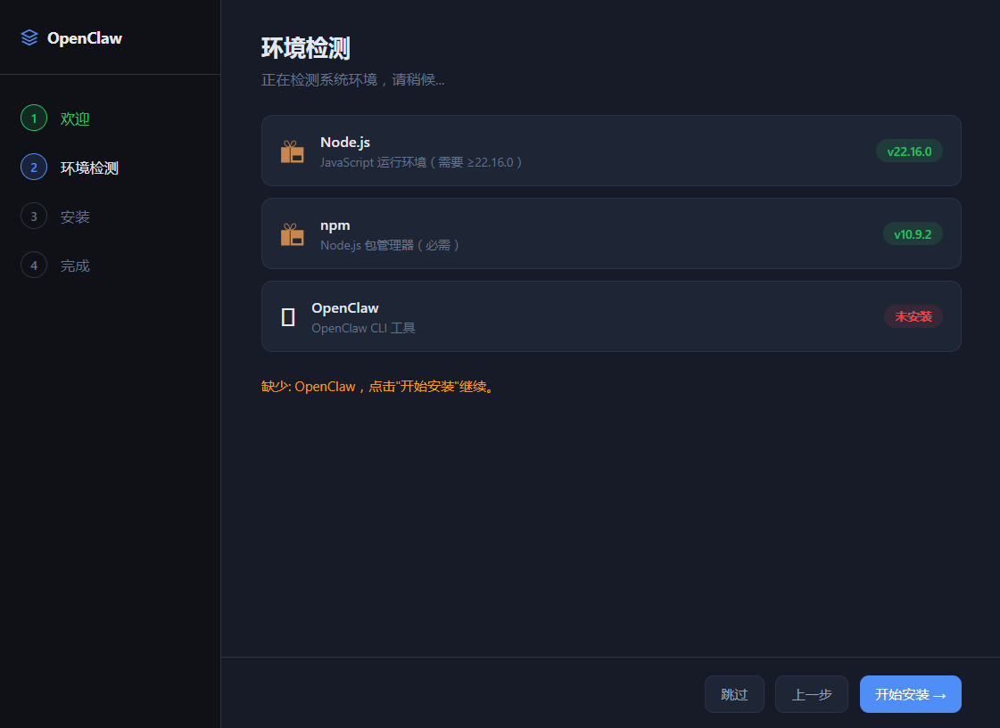 | 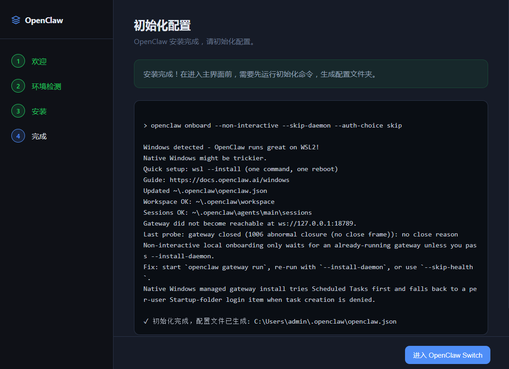 | 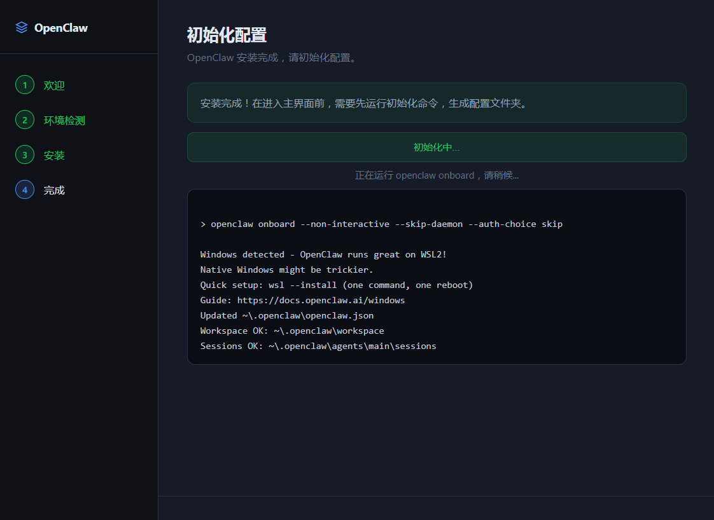 |

### 主界面

| 主界面 | 添加提供商 | 添加模型 |
|:---:|:---:|:---:|
|  | 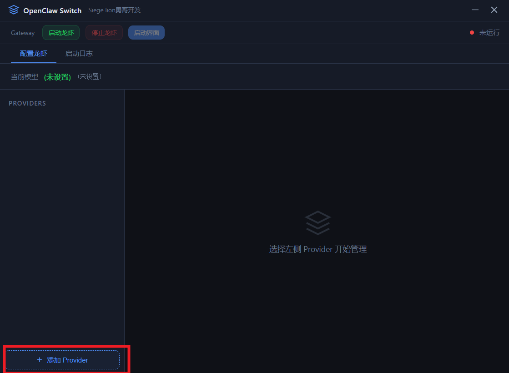 | 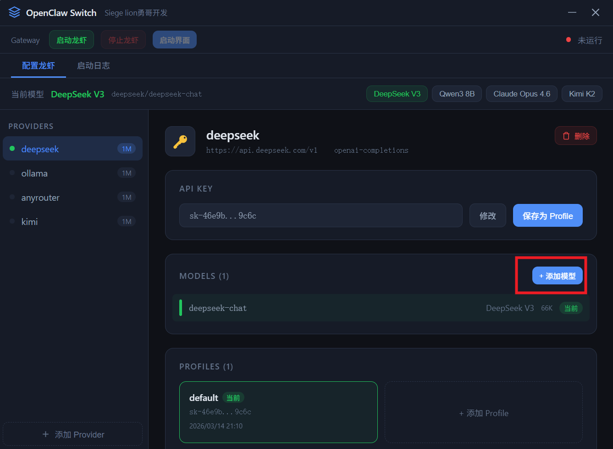 |

| 选择默认模型 | 查看日志 | Dashboard |
|:---:|:---:|:---:|
| 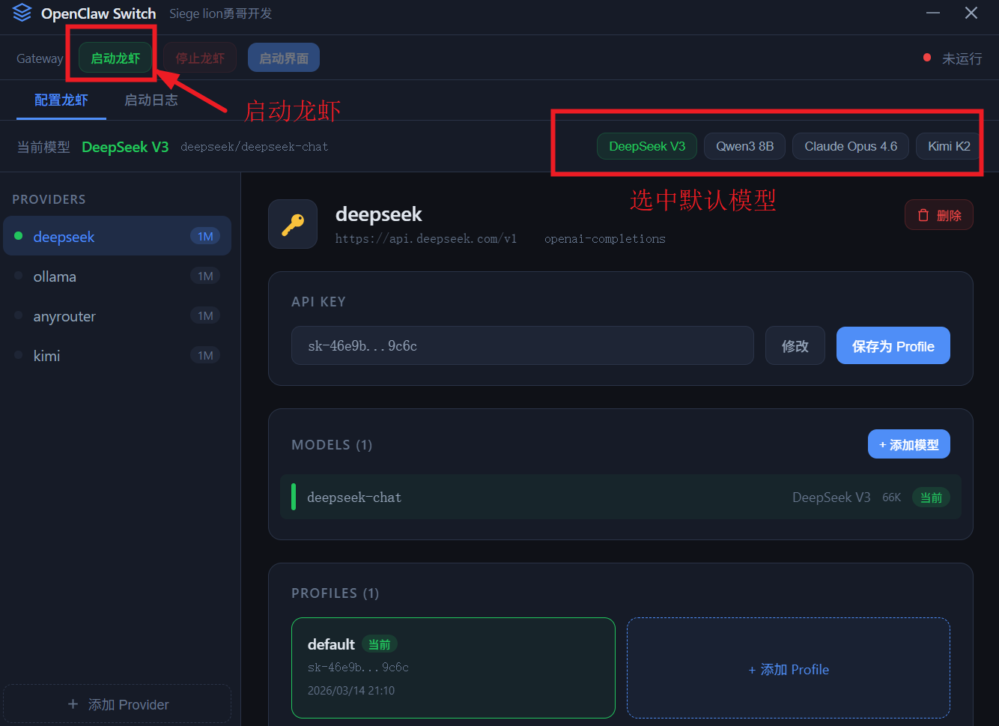 | 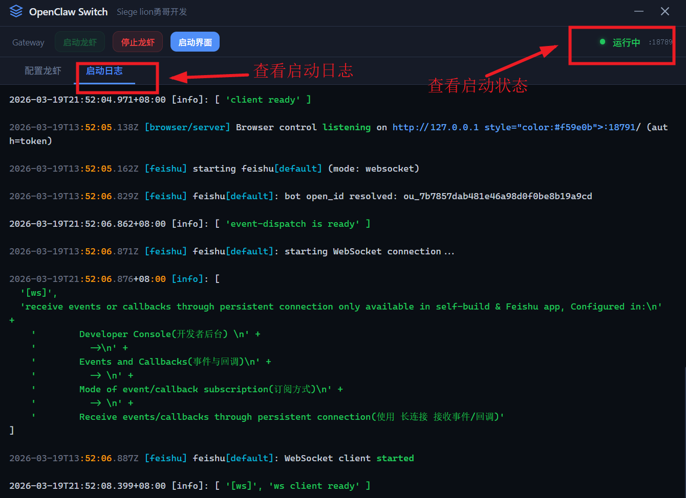 | 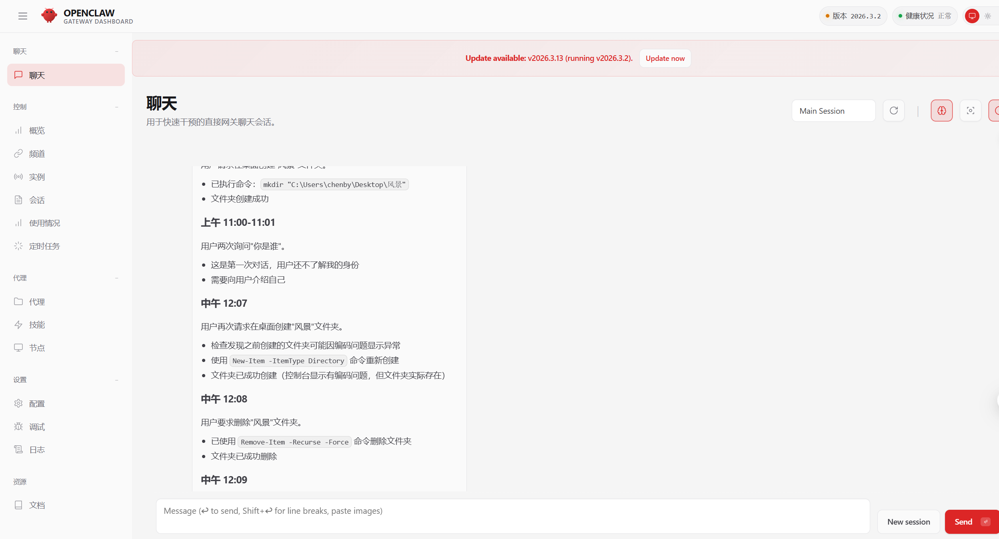 |

## 系统要求

- **操作系统**: Windows 10/11
- **Node.js**: ≥ 22.16.0
- **npm**: 随 Node.js 一起安装
- **OpenClaw**: 应用内可自动安装

## 快速开始

### 从源码运行

```bash
# 克隆仓库
git clone https://github.com/bihumanbu/openclaw-switch-gui.git
cd openclaw-switch-gui

# 安装依赖
npm install

# 启动应用
npm start
```

### 构建安装包

```bash
# 构建 NSIS 安装包
npm run build

# 构建便携版
npm run build:portable
```

构建产物在 `dist/` 目录下。

## 项目结构

```
openclaw-switch-gui/
├── src/
│   ├── main.js          # Electron 主进程
│   ├── preload.js       # 预加载脚本（IPC 桥接）
│   ├── renderer.js      # 渲染进程逻辑
│   ├── index.html       # 界面与样式
│   └── icon.ico         # 应用图标
├── screenshots/         # 项目截图
├── package.json
├── LICENSE
├── CHANGELOG.md
├── CONTRIBUTING.md
└── README.md
```

## 技术栈

- **Electron 33** — 跨平台桌面应用框架
- **原生 HTML/CSS/JS** — 无前端框架依赖，轻量快速
- **contextIsolation** — 安全的进程隔离架构

## 配置文件

应用读写以下配置文件：

| 文件 | 说明 |
|---|---|
| `~/.openclaw/openclaw.json` | OpenClaw 主配置（providers、默认模型） |
| `~/.openclaw-switch/profiles.json` | API Key Profile 存档 |
| `~/.openclaw/gateway.cmd` | Gateway 启动命令 |

## 许可证

[MIT License](LICENSE) - Copyright (c) 2026 陈碧勇

## 作者

**陈碧勇**

## 关注公众号

欢迎关注我的微信公众号 **IT架构Java进阶**，获取更多技术分享：


---

如有问题或建议，欢迎提交 [Issue](../../issues) 或 [Pull Request](../../pulls)。
